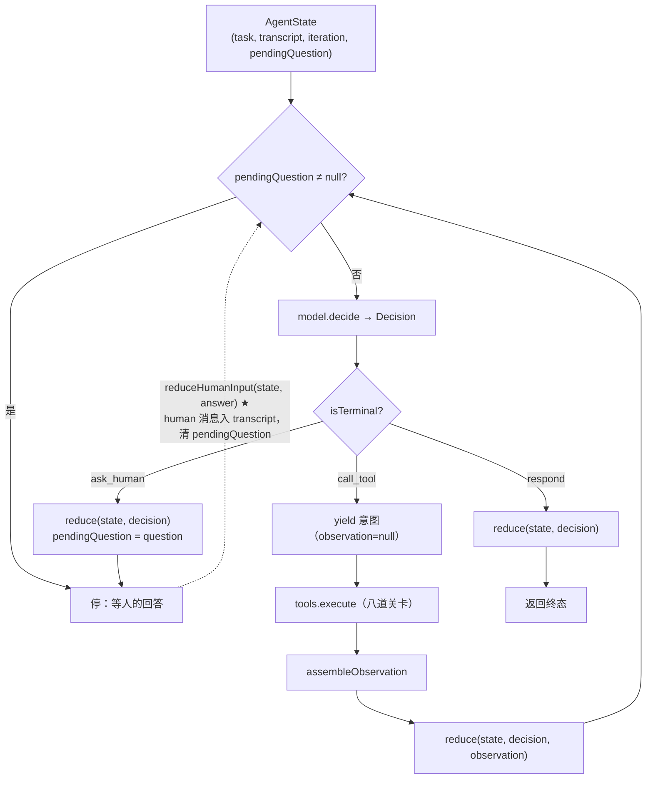
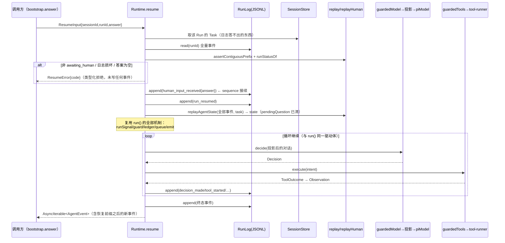
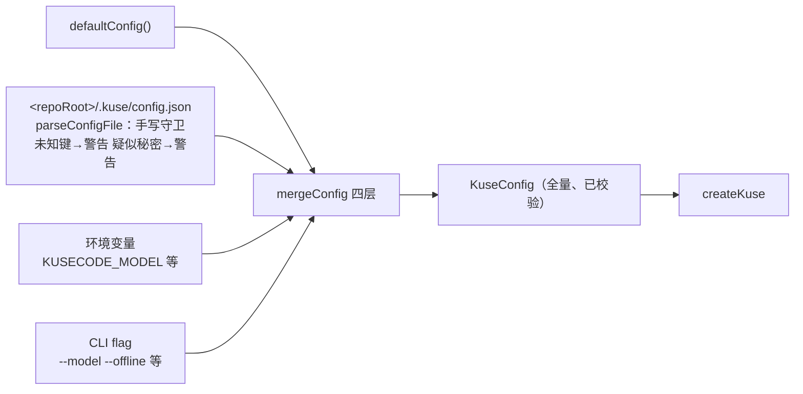

# SDD · Phase 2 — Architecture Design

> 依据：`02-spec.md`（Phase 1）。本文把 Specification 落成具体技术方案：
> 接口、类型、数据结构、四个生命周期、错误传播、事件与配置机制、测试架构。
> 代码中以本图为契约；实现与本图冲突时，先改本文档并说明原因。
>
> 标注约定：`★新增` = 本次重构引入；`◇扩展` = 既有模块的向后兼容扩展；
> 无标注 = 保持不变。

---

## 1. 系统架构图

```mermaid
graph TB
    subgraph 产品面
        CLI["CLI<br/>kuse run/answer/trace/runs/sessions"]
        DESK["Desktop RunService<br/>(Electron main)"]
    end

    subgraph 装配层 ★新增
        BOOT["bootstrap / createKuse<br/>配置解析 · Toolbox 组装 · Runtime 实例化"]
        CONF["config<br/>四层合并 + 手写校验"]
        TB["toolbox<br/>ToolSpec[] → 全套工具形状"]
    end

    subgraph Runtime
        RA["run-agent<br/>run() / resume()◇"]
        CTX["对话投影（消费点）<br/>projectConversation"]
        BUD["budget / retry / termination"]
        TR["tool-runner（八道关卡）"]
        REP["replay / trace / verify"]
    end

    subgraph Core 零依赖
        TYP["types.ts<br/>词汇 + 端口 + 事件"]
        LOOP["loop.ts<br/>reduce 家族◇ + runCoreLoop"]
        PRJ["project.ts ★<br/>对话投影词汇（纯函数）"]
        RED["redact / usage"]
    end

    subgraph 适配与存储
        PIA["adapter/pi（唯一 SDK 触点）<br/>history 消费投影◇<br/>type-only 依赖 Toolbox"]
        TOOLS["tools/repo-tools<br/>ToolSpec 实现 → 变薄为 spec 清单"]
        STORE["store<br/>JSONL 日志 + 会话索引"]
        FAKE["testing 假件"]
    end

    CLI --> BOOT
    DESK --> BOOT
    BOOT --> CONF
    BOOT --> TB
    BOOT --> RA
    BOOT --> STORE
    TB --> TOOLS
    TB --> TR
    RA --> LOOP
    RA --> BUD
    RA --> TR
    RA --> REP
    RA --> CTX
    CTX --> PRJ
    LOOP --> TYP
    PRJ --> TYP
    PIA --> TYP
    PIA --> PRJ
    PIA --> LOOP
    PIA -. type-only .-> TOOLS
    STORE --> RA
    FAKE --> TYP
```

依赖方向全部向下；`core` 没有任何向上的箭头。`adapter/pi` 是唯一的 SDK 触点，
`PRJ`（投影词汇）在 Core，所以适配器消费它不引入新依赖方向。

---

## 2. 模块依赖图（文字版 + 禁线）

| 模块 | 允许依赖 | 禁止 |
|---|---|---|
| core | 无 | 一切 import（`test/core-types` 钉住） |
| runtime | core | SDK、store、adapter |
| tools / toolbox | core、runtime（仅执行层工厂） | SDK |
| adapter/pi | core、tools（type-only：Toolbox/JsonObjectSchema，现状已如此）、SDK | runtime、store |
| store | runtime（契约） | SDK |
| config ★ | 无 | 一切（纯函数 + 手写守卫） |
| bootstrap ★ | core、runtime、toolbox、adapter/pi、store、config | electron、process（IO 注入） |
| cli / desktop | bootstrap、store（只读查询） | 直接接线 runtime/store/tools |
| testing | core、runtime | SDK |

禁线的可执行证明：`test/no-runtime-deps.test.ts` ◇扩展扫描范围至
`toolbox.ts`、`config/`、`bootstrap/`（它们不许 import SDK）。

---

## 3. 核心接口与类型定义

> 只列**变化**的部分；未列出的既有接口一字不动。

### 3.1 对话投影（Core，`src/core/project.ts` ★）

```ts
/** 投影策略：全部由调用方注入，Core 不认识配置。 */
export interface ProjectionPolicy {
  /** 保护窗口：最近 K 个"轮"逐字保留（轮的定义见 3.1.1）。 */
  readonly keepRecentTurns: number;
  /** 投影 token 预算：估算超过它时从最旧的轮开始折叠，直到入界。 */
  readonly projectionTokenBudget: number;
  /** 折叠后的单条观测摘要上限（字符）。 */
  readonly foldedObservationChars: number;
  /** 折叠后的单条决策文本上限（字符）。 */
  readonly foldedDecisionChars: number;
}

/**
 * 投影产物的一个轮次。刻意不是 Message：折叠产物不能冒充进入过
 * 状态与事件日志的 Observation（那是"唯一真相"的形状）。
 */
export type ProjectedTurn =
  | { readonly kind: "verbatim"; readonly messages: readonly Message[] }
  | { readonly kind: "folded"; readonly digest: readonly string[] };

/** 任务面（不变，来自 renderContext）+ 对话面（新增）。 */
export interface ProjectedConversation {
  readonly turns: readonly ProjectedTurn[];
  /** 估算 token（chars/4，确定性），供预算联动与测试断言。 */
  readonly estimatedTokens: number;
  /** 实际折叠掉的轮数（0 = 投影等于全量）。可观测性字段，不进日志。 */
  readonly foldedTurns: number;
}

/**
 * 把状态投影为"发给模型的对话"。全函数：任何合法 AgentState 都有
 * 定义良好的结果；确定性：同 (state, policy) 逐字节同结果。
 */
export function projectConversation(
  state: AgentState,
  policy: ProjectionPolicy,
): ProjectedConversation;

/** 确定性 token 估算（≈ chars/4），投影与测试共用。 */
export function estimateTokens(text: string): number;
```

**3.1.1 "轮"的定义**：一个 turn = 一条 `assistant` 决策消息 + 紧随其后的
`tool` 观测消息（若有）+ 恢复场景下的 `human` 消息（若有）。
**切点只落在轮边界**——call_tool 的意图与它的观测永远在同一侧，
对齐 tinycode"切点不拆散 assistant 与其工具结果"的经验。

**3.1.2 折叠摘要的形状**（确定性拼接，无模型参与）：

```text
[轮 N] 工具(参数摘要) → 首行…（结果 1,234 字符，超出部分折叠）
[轮 N] 决策：respond 前的思考文本摘要…        ← call_tool 决策本身只有意图，无文本
```

- 摘要行必须携带 `path` / 行号等**证据结构**（来自 intent 参数与观测值的
  已知字段），Evidence 可追溯性不因折叠丢失（FR-1.1）；
- 摘要以 `[已折叠]` 类可见标记开头（"截断必须可见"的既有规矩）。

### 3.2 恢复（Runtime ◇，`src/runtime/run-agent.ts`）

```ts
/** AgentRuntime 接口新增可选方法（沿用 beginRun? 的先例，不破既有实现者）。 */
export interface AgentRuntime {
  run(task: Task, signal?: AbortSignal): AsyncIterable<AgentEvent>;
  resume?(input: ResumeInput, signal?: AbortSignal): AsyncIterable<AgentEvent>;
}

export interface ResumeInput {
  readonly sessionId: string;
  readonly runId: string;
  /** 人的回答。空串在入口即被类型化拒绝（FR-2.6）。 */
  readonly answer: string;
}

/** 恢复入口的类型化拒绝（FR-2.6）。 */
export class ResumeError extends Error {
  readonly code:
    | "run_not_found"        // 日志不存在
    | "session_mismatch"     // runId 不属于 sessionId
    | "not_awaiting_human"   // runStatusOf(events) !== "awaiting_human"
    | "empty_answer"
    | "log_corrupted";       // 非连续前缀 / 双终态（replay 的既有校验）
}

export function emptyStateFor(task: Task): AgentState;          // 不变
export function reduceHumanInput(state: AgentState, answer: string): AgentState;  // ★ Core
```

**`reduceHumanInput` 语义**（Core，`loop.ts` ◇）：

- `transcript += { role: "human", answer }`；
- `pendingQuestion → null`（与"任何非 ask_human 决策清空问题"同规则）；
- **`iteration` 不变**："轮"数的是模型决策轮，人的回答不消耗迭代预算；
- 纯函数，实时/回放/测试三路共用（唯一推进函数家族的第三个成员）。

### 3.3 Toolbox（`src/toolbox.ts`，◇扩展既有词汇）

> 事实修正：`Toolbox` 接口**已存在**于 `repo-tools.ts`（`{ names, specs, port }`，
> adapter/pi 以 type-only 方式依赖它）。本次不是新增词汇，而是把它**升格为通用
> 组装点**并补齐执行层形状。

```ts
/** 工具的公共词汇。形状与现状一致，从 repo-tools 升格到通用位置。 */
export interface ToolSpec {
  readonly name: string;
  readonly description: string;
  readonly parameters: JsonObjectSchema;
  readonly parse: (args: Readonly<Record<string, unknown>>) => Record<string, unknown>;
  readonly run: (args: Record<string, unknown>, context: ToolContext) => Promise<unknown>;
  readonly material?: (value: unknown) => readonly MaterialRef[];
}

export interface ToolboxOptions {
  readonly repoRoot: string;
  readonly clock: () => number;
  readonly timeoutSignal?: TimeoutSignalFactory;
  /** 发现类工具的仓库相对跳过清单（语义沿用 RepoToolsOptions.ignore）。 */
  readonly ignore?: readonly string[];
}

/** Toolbox 扩展后的形状（★ = 相对现状新增的三个字段）。 */
export interface Toolbox {
  readonly names: readonly string[];
  readonly specs: readonly ToolSpec[];
  readonly port: ToolPort;                                    // 不变（已包八道关卡）
  readonly assembleObservation: AssembleObservation;          // ★
  readonly collectMissingMaterial: CollectMissingMaterial;    // ★
  readonly materialReader: MaterialReader;                    // ★（从独立函数收拢进来）
}

/** 通用组装：ToolSpec[] + 选项 → 全套形状（FR-4.1）。 */
export function createToolbox(
  specs: readonly ToolSpec[],
  options: ToolboxOptions,
): Toolbox;

/** repo-tools 变薄：只产出 spec 清单，组装交给 createToolbox。 */
export function createRepoToolSpecs(options: {
  repoRoot: string;
  ignore?: readonly string[];
}): readonly ToolSpec[];
```

重名注册即抛错（现状已有，保留）；`createToolbox` 内部 = 现在
`createRepoTools` 的 port 组装 + `createToolRunner` 的执行层包装 +
`materialReader(box)` 的收拢。adapter/pi 的 type-only import 改指向新位置，
依赖方向不变。

### 3.4 配置（`src/config/` ★）

```ts
export interface KuseConfig {
  /** "provider/model" 或 "offline"。null = 环境解析失败时离线兜底由装配层决定。 */
  readonly model: string | null;
  readonly budget: RunBudget;
  readonly projection: ProjectionPolicy;
  /** runs/sessions 数据根。null = 默认 <repoRoot>/runs。 */
  readonly dataRoot: string | null;
}

export function defaultConfig(): KuseConfig;
/** 手写守卫：解析 JSON 文本 → 部分配置 + 警告（未知键/疑似秘密）。 */
export function parseConfigFile(text: string): {
  readonly config: Partial<KuseConfig>;
  readonly warnings: readonly string[];
};
/** 四层合并：flag > env > file > default。浅层逐键，对象逐字段。 */
export function mergeConfig(
  layers: readonly (DeepPartial<KuseConfig> | null)[],
): KuseConfig;
```

**默认值**（工程判断，可按 golden 校准；spec FR-1.4 的承诺在此兑现）：

| 项 | 默认 | 依据 |
|---|---|---|
| `projection.keepRecentTurns` | 8 | 覆盖最近一次工具结果全文 + 一段行动史 |
| `projection.projectionTokenBudget` | 48_000 tokens（≈192k chars） | 现代模型窗口的保守份额 |
| `projection.foldedObservationChars` | 400 | 一行证据结构 + 首行 |
| `projection.foldedDecisionChars` | 200 | |
| `budget.maxInputTokens` | 200_000（从 null 改为有界） | 投影使请求有界后默认设防（spec 唯一默认行为变化） |
| 其余 budget | 不变（32 轮 / 64 工具 / 重试 2 / 10min） | |

### 3.5 装配层（`src/bootstrap/` ★）

```ts
export interface KuseOptions {
  readonly repoRoot: string;
  readonly config: KuseConfig;            // 已合并
  readonly dataRoot: string;              // config.dataRoot ?? <repoRoot>/runs
  /** 测试注入；缺省 = 真实时间与 crypto id。 */
  readonly clock?: () => number;
  readonly ids?: IdFactory;
}

export interface StartRunInput {
  readonly goal: string;
  readonly checks: readonly string[];
  readonly model: "offline" | { readonly spec: string };  // 两路模型
}

/** 一次 Run 的句柄：消费事件流，结束时从日志读 trace/audit（铁律：trace 从日志读）。 */
export interface RunHandle {
  readonly sessionId: string;
  readonly runId: string;
  readonly events: AsyncIterable<AgentEvent>;
  readonly finished: Promise<RunFinished>;   // { trace, audit, exitStatus }
}

export interface Kuse {
  readonly config: KuseConfig;
  startRun(input: StartRunInput, signal?: AbortSignal): Promise<RunHandle>;
  answer(sessionId: string, runId: string, answer: string, signal?: AbortSignal): Promise<RunHandle>;
  trace(sessionId: string, runId: string): RunTrace;          // 零 SDK
  sessions(): readonly SessionSummary[];
  audit(sessionId: string, runId: string): EvidenceAudit | null;
}

export function createKuse(options: KuseOptions): Promise<Kuse>;
```

`createKuse` 是唯一出现模型解析（offline/env 两路）与 SDK 动态加载的地方；
CLI 与 RunService 各自只剩"参数 → config → createKuse → 渲染"。

---

## 4. 四个生命周期

### 4.1 Agent 生命周期（Core 循环，◇扩展一处）



不变量：状态只经 `reduce` / `reduceHumanInput` 推进；前者每轮恰好一次
（call_tool 的观测那一次），后者每次恢复恰好一次。

### 4.2 Runtime 生命周期

**run()（不变，复述以对照）**：

```text
建 runSignal（外部取消 + 墙钟合流）→ 建 guard（一次 Run 的账本）
→ ledger = model.beginRun?(signal)
→ emit(run_started) → 循环消费 runCoreLoop（事件 write-ahead）
→ 终态：usage → run_completed/run_failed/human_input_requested
→ catch：emitStop（归因顺序：信号 → RunStoppedError → toRunError）
→ finally：dispose；未 settled 则补 usage + run_cancelled
```

**resume() ★（同一条路径的新起点，不是第二套机制）**：



要点：

1. **校验先于写入**：任何拒绝都发生在第一条新事件之前（失败不留痕，
   与"被拦下的调用不留 `tool_started`"同一纪律）；
2. **sequence 接续**：`emit` 的序号从既有日志长度起算，append-only 的
   连续性检查（`assertAppendOnly`）因此天然通过；
3. **账目续记**：resume 是同一次 Run，`usage_reported` 仍是整 Run 恰好一条——
   已报过账（挂起前）则恢复路径不再重复报（幂等闸门 `usageEmitted` 延续生效），
   挂起前的账目从旧日志的 `usage_reported` 事件上读回；
4. **旧前缀不动**：恢复只追加，旧事件逐字节不变（NFR-1）。

### 4.3 Tool 生命周期（不变，收拢进 toolbox）

```text
ToolSpec 注册（重名即抛）→ 意图进入 port.execute：
  ① allowlist 检查 → ② 参数 JSON 无损校验 → ③ 取消检查 → ④ 60s 超时组合信号
  → spec.parse（schema 校验，ToolArgumentError=invalid_args）
  → spec.run(context: repoRoot/signal/ignore)
  → ⑤⑥⑦ 归一 ToolOutcome（形状/无损/截断 8k）→ ⑧ 组装 provenance（唯一写入点）
→ Observation 进 transcript 与事件日志
失败路径：①②⑤⑥⑦ = error 观测（Run 继续）；③ = 原样上抛（停止不是工具的错）；
④ = timeout 观测；parse 抛错 = invalid_args 观测；run 抛错 = tool_failed 观测
```

### 4.4 Context 生命周期（★核心新增，执行时机）

```text
每次 model.decide 之前（每轮恰好一次）：
  state ─→ renderContext(state, names)         任务面（既有，Core）
        ─→ projectConversation(state, policy)  对话面（新增，Core 纯函数）
  两者在 adapter/pi/history.buildRequest 处合流：
    verbatim turns → 现有翻译（Decision→assistant / Observation→tool result）
    folded turns   → 一条 user 文本消息（可见标记 + digest 行）
  产物 = provider 请求（每轮重建，不缓存）
```

执行位置与顺序（关键决定）：投影发生在**受守卫的模型端口内侧、真实端口外侧**——

```text
guardedModel（预算/事件/重试，看到真实 state）
  → 投影（projectConversation）
    → piModel.decide（SDK 只见投影产物）
```

因此：`no_progress` / 迭代 / 工具预算全部基于**真实状态**判断，
投影永远不会掩盖"这一轮其实没有新观测"；投影也不可能绕过预算执法。

---

## 5. 错误传播机制

四层，每层有明确的"变成什么"：

| 层 | 错误 | 变成什么 | 依据 |
|---|---|---|---|
| 工具层 | spec 抛错 / 参数非法 / 超时 | **error 观测**（数据，Run 继续，终态 partial 点名缺失） | 既有八道关卡 |
| 模型层 | 限流/超时/鉴权/不可用 | 适配器翻译为 `RunErrorCode` → 可重试的进入退避，不可重试的成为 `run_failed` 事件 | 既有 retry/errors 映射 |
| 驱动层 | 取消 / 预算 / 空转 / 墙钟 | `run_cancelled` / `run_failed{code}` 事件（emitStop 归因顺序不变） | 既有 |
| 入口层 ★ | 配置非法 / resume 校验失败 | **启动/入口即失败**：`ResumeError{code}`、配置守卫错误——类型化、可操作、**未写任何事件** | FR-2.6 / FR-5.3 |

新原则一句话：**Run 内的错误是数据，Run 外的错误是入口的拒绝**；
恢复入口属于"Run 外"，所以校验失败绝不污染既有日志。

---

## 6. 事件机制

### 6.1 事件词汇表（◇两处语义激活，零载荷变化）

13 种既有事件的载荷与顺序语义**全部不变**。变化只有两处，且都是
"从未被生产的变体开始被生产"：

| 事件 | 变化 | 生产者 |
|---|---|---|
| `human_input_received` | 回放从"抛错"变为合法分支；生产者出现 | resume（答案非空、目标确在挂起态） |
| `run_resumed` | 同上 | resume（紧随其后） |

回放对二者的新语义（`replay.ts` ◇）：

```text
human_input_received：要求 state.pendingQuestion ≠ null（否则日志矛盾，抛错）
                      → state = reduceHumanInput(state, input)
run_resumed：         仅记录，不推进状态（"继续跑"由后续事件体现）
```

`runStatusOf` 的映射表无需改动（`human_input_received → null`、
`run_resumed → running` 已在步 7 的表里）。

### 6.2 write-ahead 不变量（不变，resume 延续）

- 事件先 `log.append` 再入队送消费者：消费者看到的永远是日志的前缀；
- `sequence` 由 emit 闭包私有推进，resume 时从既有日志长度起算；
- 一次 Run 至多一个终态事件；挂起（`awaiting_human`）**不是终态**，
  这正是"恢复 = 在同一日志上继续"的结构依据。

---

## 7. 配置加载机制



- 合并规则：逐键覆盖，`DeepPartial` 逐字段；**高层覆盖低层必须可见**
  （`Kuse.configSources` 或 verbose 打印，Phase 3 实现时定形）；
- 秘密红线：`parseConfigFile` 检出疑似凭据键（key/token/secret 命名）→ 警告；
  配置任何内容不进事件日志（它本来就不在事件路径上）；
- 校验失败（类型错/越界）→ 启动即失败，错误指出键名与期望类型。

---

## 8. 测试架构

```mermaid
graph TB
    subgraph 金线（语义回归）
        G["golden transcripts<br/>既有 8 组：逐字节不许动<br/>★新增：挂起-恢复组、长任务投影组<br/>双路径（fake/SDK）逐字节一致"]
    end
    subgraph 契约
        C1["core-types：零 import 扫描 ◇含 project.ts"]
        C2["no-runtime-deps ◇含 toolbox/config/bootstrap"]
        C3["Decision/reduce 穷尽性（编译期）"]
    end
    subgraph 单元
        U1["project：确定性/有界/保护窗口/折叠标记/证据保全"]
        U2["reduceHumanInput + resume 校验矩阵（ResumeError 全码）"]
        U3["toolbox：组装/重名/关卡透传"]
        U4["config：四层合并/类型错/未知键/秘密警告"]
    end
    subgraph 集成
        I1["CLI answer：挂起→应答→恢复→终态，退出码"]
        I2["桌面 RunService 换用 bootstrap 后行为不变"]
        I3["混合日志：旧前缀 + 新恢复事件可回放"]
    end
    subgraph 任务级 e2e ★
        E["fixture 仓库 + fake 剧本驱动真装配：<br/>报告交付 + auditRun 全部论断有据<br/>+ 日志可回放 + trace 三问齐备"]
    end
```

注入件（全部复用 `src/testing`）：`sequentialIds`、计数时钟、
`fake-signals`（零真实时间验证重试/超时）、fake-model（剧本扩展一条
"ask_human → 等待 → resume → 继续"的剧本）、fake-tools。

CLI 测试摆脱 dist（FR-6.3）的选型：**测试内动态 import `src/cli/main.ts`**
（vitest 已能跑 TS 源码，`main(argv, io)` 本就是进程内可测的形状），
`bin/kuse.mjs` 保留为发布入口不再被测试依赖。

---

## 9. 与既有文档的关系

| 既有文档 | 关系 |
|---|---|
| docs/02–10（步 1–10 权威记录） | 不改写；本文档的"不变"声明即对它们的引用 |
| docs/11（桌面壳） | RunService 消费 bootstrap 后其"接线"一节由实现任务更新 |
| README 开发序列 | 重构完成后由收尾任务追加"重构序列"小节 |

---

*Phase 3（`04-implementation-plan.md`）把本文档拆成可独立提交、可验证的任务序列。*
